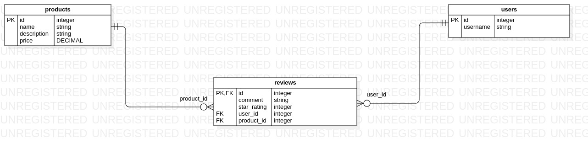

# PRODUCT REVIEW SYSTEM
 
# Entitity Relationship Diagram 

## Description
- This is a product review system built using Ruby and ActiveRecord. It allows users to leave reviews for products and view reviews left by others. The system also allows users to view their favorite product and remove reviews for a specific product.

## Installation
1. Clone the repository `git@github.com:Barsu5489/ShopperVoice.git`
2. Run `bundle install` to install dependancies.
3. Run `rake db:migrate rake db:seed` to run migrate and seed database with sample data.

## How to use
- To use the product review system, start the rake console by running `rake console`.

# License
- This project is licensed under the MIT License.
- Owner `Emmanuel Kipkemboi Barsulai`
- Github `https://github.com/Barsu5489/ShopperVoice`